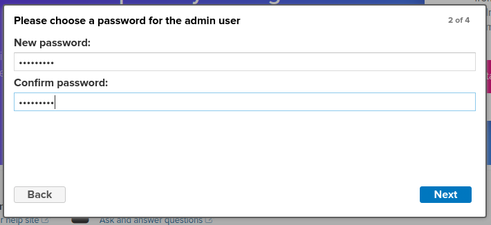

# Instalando o Nexus 3 

## Inicie o container com o comando abaixo, abrindo as portas 8081, 8082 e 8083
> docker-compose up -d

**Demora um tempo até que o container se inicie, espere uns minutos, acompanhe a inicialização com o comando abaixo:**
> docker logs -f nexus3

## Entre no container e pegue a senha iniciar do administrador
> docker-compose exec nexus bash
> 
> cd /nexus-data
> 
> cat admin.password
> 
> - 6518c4fb-df13-4bd5-ac40-938868c246be

**Logue a primeira vez com o user e a senha acima, será necessário terminar a configuração do setup**

## Acessando a interface do Swagger no Nexus3
> Logue como admin
> 
> Navegue no menu System / API