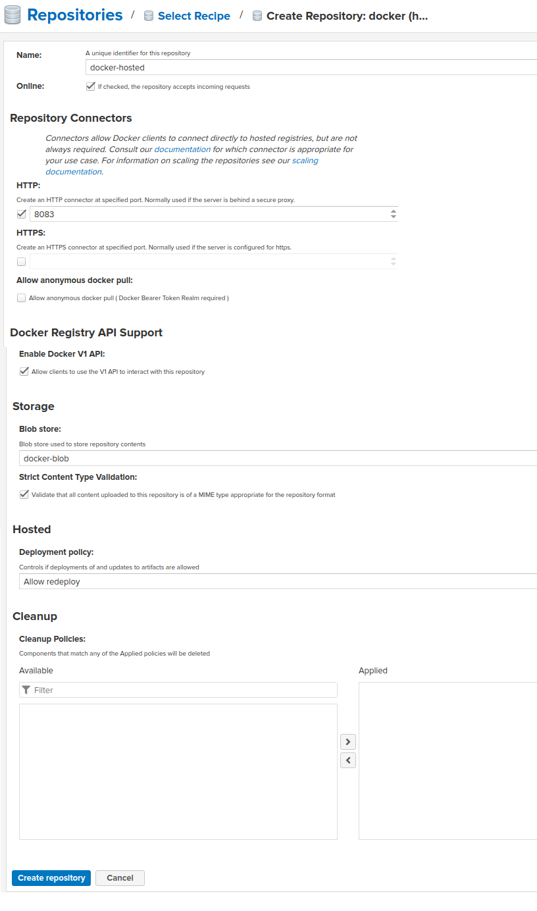
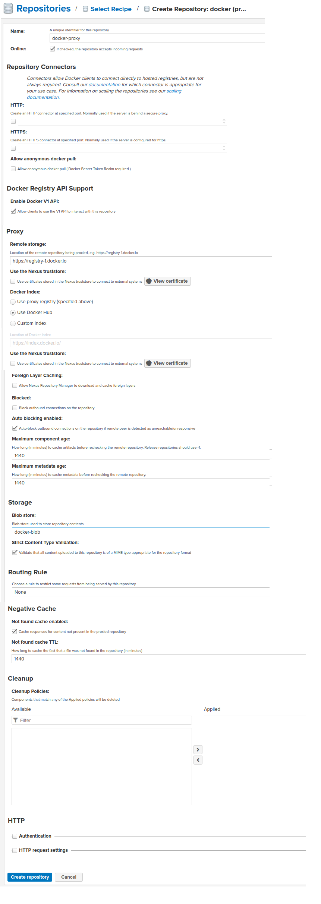
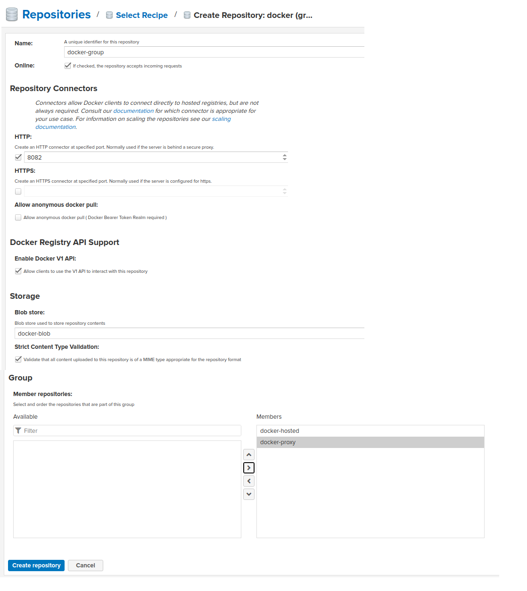

# Criando repositórios para o Docker

Para configurar o Docker no Nexus3 devemos considerar a criação de 3 repositórios conforme abaixo:
- Um repositório privado para nossas próprias imagens (docker-hosted).
- Um repositório proxy apontando para o Docker Hub (docker-proxy).
- Um repositório para agrupar os 2 repositórios em uma única URL (docker-group).

É interessante criar um blob store exclusivo para o docker desta forma os objetos do docker ficarão em uma pasta diferente dentro do /nexus-data.

Por default, a comunicação é feita por HTTPS, mas no nosso caso faremos por HTTP para não ter de obter um certificado digital para a demonstração.

## Docker Hosted

## Docker Proxy

## Docker Group

## Configurando o client para usar o Nexus

Para configurar o docker daemon na máquina para aceitar requisições HTTP inves de HTTPS.

Abra ou crie o arquivo /etc/docker/daemno.json e coloque a seguinte configuração:

> {
> 
>     "insecure-registries": [
>         "127.0.0.1:8082",
>         "127.0.0.1:8083"
>	  ]
> }

Após configurar temos de reiniciar o daemon
- sudo systemctl restart docker

## Autorize o Docker a se comunicar com o Nexus
> echo "\<password\>" | docker login -u admin --password-stdin 127.0.0.1:8082
> 
> echo "\<password\>" | docker login -u admin --password-stdin 127.0.0.1:8083

Isto vai criar o arquivo ~/.docker/config.json