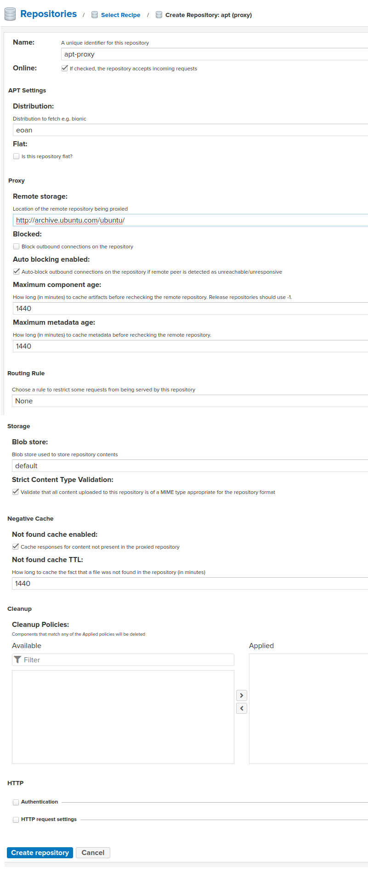
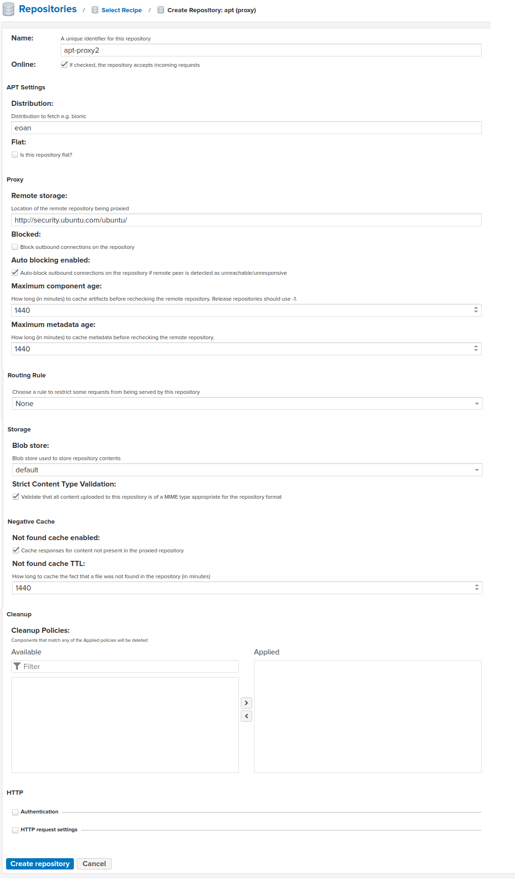

# Criando repositórios para atualizar o Ubuntu (APT)

Como vamos basicamente baixar atualizações e dependências e nunca criar para o sistema, vamos criar apenas repositórios proxy

# Apt Proxy 1

# Apt Proxy 2

